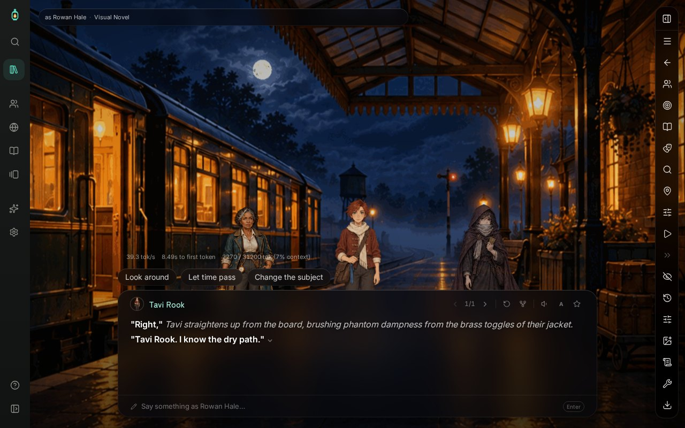
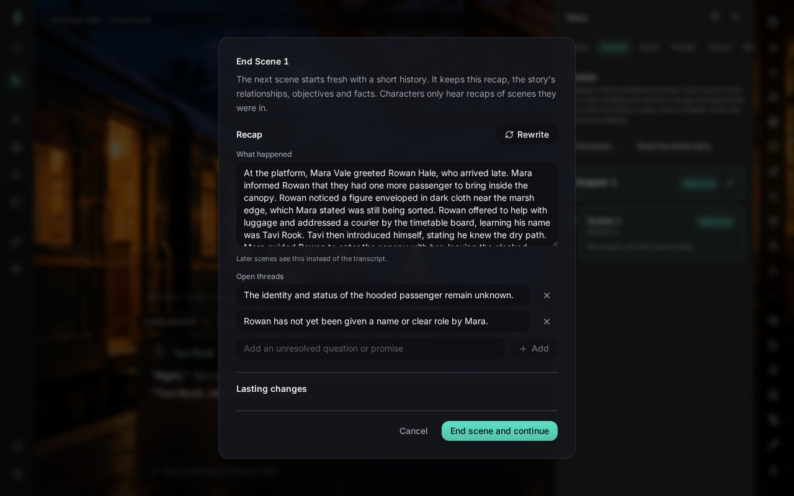
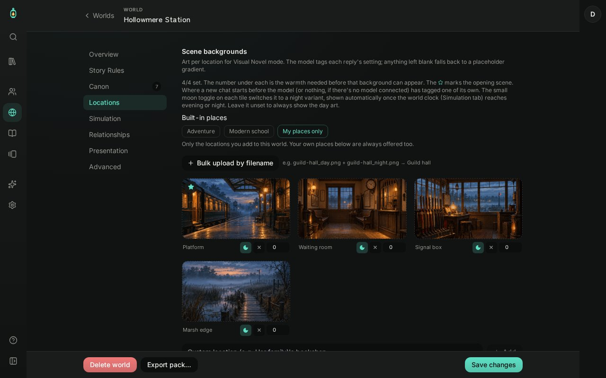
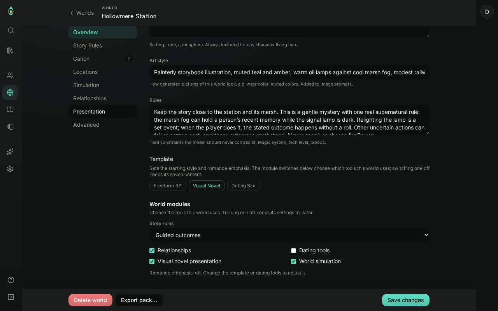
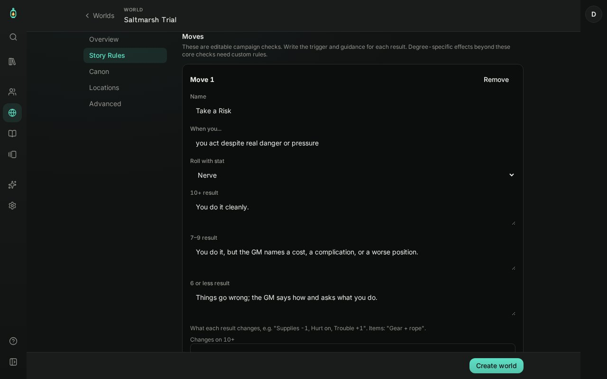
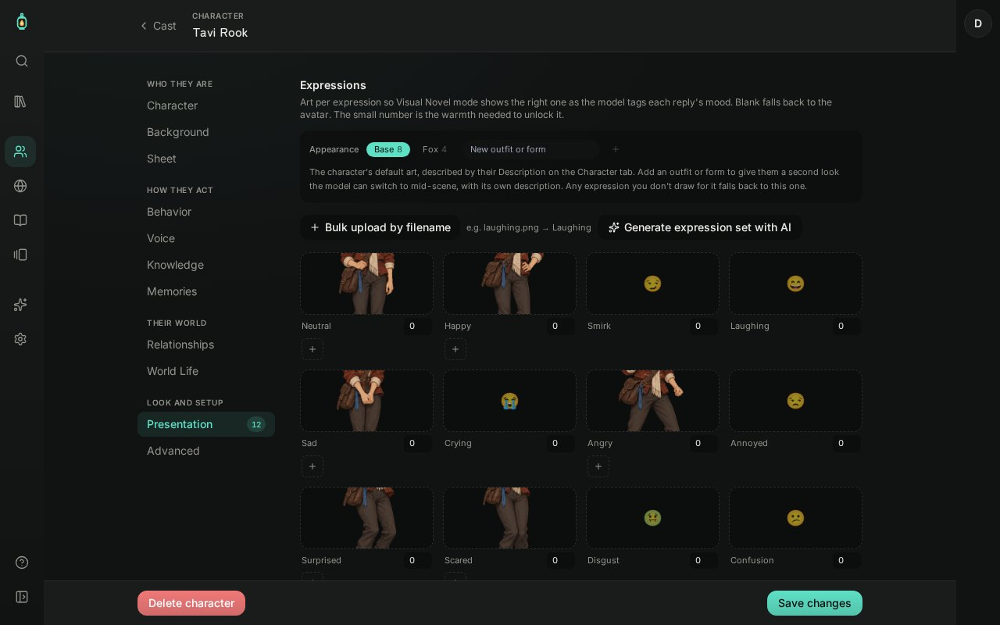
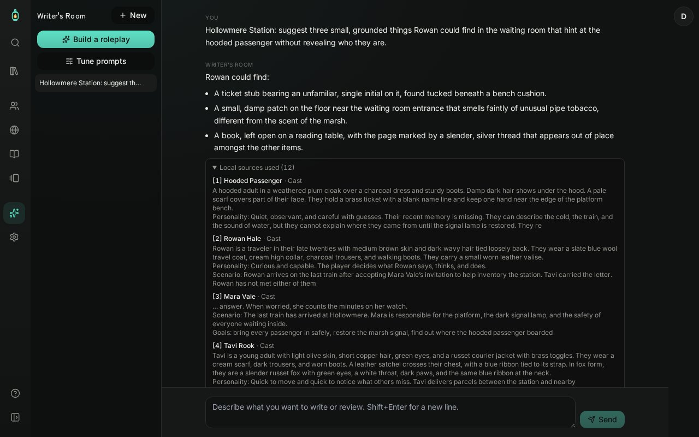

# Lost Tales Engine

**Build a world. Bring a cast to life. Play a story whose choices and rolls matter.**

Lost Tales Engine is a local-first roleplay and story engine. Create a setting and characters, play through scenes with an AI Game Master, and choose between freeform storytelling and recorded mechanical checks. It began as a fork of [RP Suite](https://github.com/pnotisdev/rp).

**New here?** Follow the [Quick Start](https://github.com/guswadsworth12/Lost-Tale-Engine/wiki/Quick-Start). The [full wiki](https://github.com/guswadsworth12/Lost-Tale-Engine/wiki) covers play, world building, hosting, and contribution.

[](screenshots/wiki-hollowmere-visual-novel.jpg)

*Screenshot of the bundled Hollowmere Station story on a fresh install, played with a local model (Gemma 4 E4B through Ollama). The reply is the model's own.*

### Try the Hollowmere story

Hollowmere Station is the bundled Visual Novel starter world. Rowan arrives on the last train, meets stationmaster Mara Vale and courier Tavi Rook, and helps a passenger whose name has vanished in the marsh fog. The short story spans the platform, signal box, and marsh edge. Tavi has both human and fox forms.

| Ending a scene | The world's locations |
| :--- | :--- |
| [](screenshots/wiki-end-scene.jpg) | [](screenshots/wiki-world-locations.jpg) |

*Screenshots from the same fresh install. See the [Hollowmere wiki](https://github.com/guswadsworth12/Lost-Tale-Engine/wiki/Hollowmere-Station) for the story outline.*

## Explore the app

### Play stories as scenes

**Stories** is the library for your ongoing roleplays. Start with a world, a player character, and cast members. A story is organized into chapters of numbered scenes; ending a scene saves its recap and opens the next, and ending a chapter records its recap and open threads and opens the next chapter with its own name and goal. During play you can inspect the assembled prompt, set goals, use suggested replies, and fork or rewind the conversation. The Game Master directs group turns without speaking for the player character.

Choose **Classic** for a transcript or **Visual Novel** for a staged scene. On desktop, you can arrange the cast, set each character's size and how they enter and leave, and save the arrangement as a layout any scene in the world can reuse; the scene keeps it through a reload. When the speaker changes, only the speaker moves. On mobile, the current speaker (or the last one, during narration) stands above the dialogue box. Visual Novel controls collapse into a side rail so you can leave the stage and reach the rest of the app.

### Shape a world and its rules

**Worlds** holds setting instructions, lore, locations, music, and optional systems. Start from Freeform RP, Visual Novel, or Dating Sim defaults, then choose the modules each world uses: story rules, relationships, dating tools, Visual Novel presentation, and world simulation. Romance emphasis follows the world's choices.

| World modules | Story rules and move outcomes |
| :--- | :--- |
| [](screenshots/wiki-world-modules.jpg) | [](screenshots/wiki-ruleset-moves.jpg) |

In **Story Rules**, build character-sheet fields, moves, targets, and a rank ladder. **Cast → Sheet** stores a separate sheet for each world, so a character can have different stats across settings. Starter presets cover 2d6 moves, D&D 5e SRD core checks, Starfinder 2e core checks, Fate Core skill checks, and a generic 3d6 roll-under check. These provide editable fields and check resolvers, not full implementations of those games.

A world can travel as a **world pack**: its settings, rules, lore, cast templates, and chosen art and music, without anyone's stories or private notes. Imports are previewed before anything is written and stay private to the importing account until shared. See [world packs](docs/WORLD_PACKS.md).

In **mechanical** mode, the server records the dice, modifier or sheet value, target, and outcome before the GM narrates. A failed check remains a failure even if a model response claims success. A successful check establishes the result while leaving room to ask follow-up questions and choose what happens next. **Guided** mode gives the GM rules context without enforcing a dice result. See the [campaign guide](docs/CAMPAIGN_ENGINE.md) for the GM contract.

### Give characters a look and a sheet

**Cast** covers character background, behavior, knowledge, relationships, voice, presentation, and world-specific sheets. Import or export SillyTavern V2/V3 cards. Add portraits, Visual Novel expressions and outfits, and optional VRM models to individual characters; scene backgrounds stay with their worlds.

[](screenshots/wiki-cast-presentation.jpg)

### Build with Writer's Room

**Writer's Room** can brainstorm with your configured model and search the worlds, cast, lore, stories, goals, and facts saved on this device. Its replies identify the local sources they used. The guided **Build a roleplay** flow drafts a world, lore, cast, rules, and an opening scene for review before creating them. It can also prepare an editable update to an existing character and world-specific sheet, draft a game system the presets don't cover from a description (test-roll it, then apply it to a world), and tune the prompts that drive the GM, memory, recaps, and journals for a world, with previews, history, and revert.

[](screenshots/wiki-writers-room.jpg)

**Lore** manages world information and lorebooks. **Media** browses story CG unlocks and world soundtracks; character sprites remain in Cast. Dating-focused worlds can track relationships, commitment, dates, gifts, inventory, and CG unlocks. The app also includes a guided tour and **Help & tutorial** reference.

## Get started

You need **Node.js 22.18 or newer** (Node 24 recommended; development and Docker use it) and a text-generation backend such as [KoboldCpp](https://github.com/LostRuins/koboldcpp) or an OpenAI-compatible API.

```bash
git clone https://github.com/guswadsworth12/Lost-Tale-Engine.git
cd Lost-Tale-Engine
npm install
npm run dev
```

Open `http://localhost:5173`. On a fresh data directory, create the owner account locally, then configure a model in **Settings → Models and services**. The development command starts Vite and the local Express/SQLite API (port 3001 by default). To keep data outside the checkout, copy `.env.example` to the git-ignored `.env` and set `LOST_TALES_DATA_DIR` to an absolute path before starting the app.

```bash
npm run typecheck   # check client, tooling, and server types
npm test            # run the test suite
npm run build       # type-check the client and build for production
npm start           # serve the built app and API together
```

For Docker, run `docker compose up -d --build`; see [DOCKER.md](DOCKER.md) for data storage and network settings.

## Data, providers, and limits

Worlds, characters, stories, and media live in the git-ignored `data/` folder or the folder set by `LOST_TALES_DATA_DIR`. Back up that folder or use the app's backup and restore feature. The app uses accounts, beginning with a locally created owner; hosts can add other users and control content sharing. A local model can keep inference on your machine; a hosted provider receives the prompts you send to it. See [backup and privacy](https://github.com/guswadsworth12/Lost-Tale-Engine/wiki/Backup-Restore-and-Privacy).

Text connections support KoboldCpp, OpenAI-compatible endpoints (including OpenMayhem), and NovelAI. Optional image generation supports AUTOMATIC1111, ComfyUI, SwarmUI, NovelAI, OpenMayhem, OpenAI, and Google Gemini. Hosted image keys are stored encrypted per account, and every generated image is previewed before it is saved. Voice settings include KoboldCpp, OpenAI-compatible speech, LuxTTS, ElevenLabs, Azure Speech, Alibaba, and OpenMayhem. These features depend on the providers you configure; their availability and costs vary.

- Writer's Room can write prose chapters; those are separate from a story's playable chapters.
- Mechanical presets resolve core checks. They do not implement complete D&D, Starfinder, Fate, or GURPS rules, combat, or resource tracking.
- Guided rulings are GM judgments. Only mechanical mode produces a recorded, enforced roll.
- Writer's Room can create a new RP, prepare reviewed character updates, draft game systems, and tune prompts. Conversational editing of existing worlds and lore is still outside that flow.

## Credits

Built with React, TypeScript, Vite, Tailwind, Zustand, Express, and `node:sqlite`. MIT licensed; see [LICENSE](LICENSE). Based on [RP Suite](https://github.com/pnotisdev/rp), with support for SillyTavern card formats and local-model workflows.
